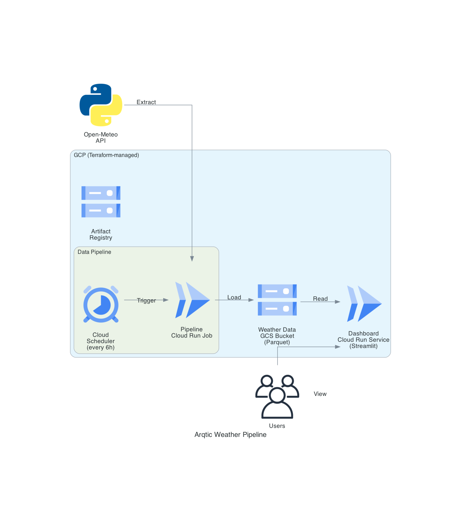

# Arqtic Weather Pipeline

I built this as a complete weather data pipeline for Toronto. It pulls weather data, runs it through quality checks, enriches it with things like comfort labels and anomaly detection, and serves an interactive dashboard that helps you decide what to wear before you leave the house. The whole thing deploys to GCP using Terraform.

**Arctiq Take-Home Assessment** | Andre | February 2026

## Quick Start

```bash
# Prerequisites: Python 3.14+, uv, graphviz (brew install graphviz)

# 1. Setup
make setup

# 2. Run the pipeline
make run-pipeline

# 3. Launch the dashboard
make run-dashboard
# -> http://localhost:8501
```

## Architecture



I went with **Open-Meteo** as the data source because it's free, requires no API key, and is backed by government weather agencies (WMO). That keeps the setup simple — anyone cloning this repo can run the pipeline immediately without signing up for anything.

For the data tool, I chose **DuckDB** over BigQuery or Snowflake. This is a weather dataset for one city — it doesn't need a cloud data warehouse. DuckDB is an embedded SQL engine that reads Parquet files directly, needs zero configuration, and reads from Google Cloud Storage the same way it reads local files. Right-sized for the problem.

**Pandera** handles data quality. Every row gets validated against a schema before it reaches storage — things like impossible temperatures or negative wind speeds get rejected immediately.

The dashboard is **Streamlit + Plotly** for interactive drill-down, and **Prophet** handles the 30-day forecast with uncertainty bands.

Everything is deployed through **Terraform** (Cloud Run, GCS, Scheduler, IAM) with **GitHub Actions** for CI/CD — lint and test on every PR, build and deploy on merge to main.

## How I Approached This

I built everything locally first. The entire pipeline, dashboard, and tests work on a laptop with no cloud credentials. Deploying to GCP is the last step — one environment variable (`DATA_PATH`) switches from local files to a cloud storage bucket. Switching cities is also just a config change in `config.py`. I wanted to make sure any engineer could clone this, run three commands, and have a working dashboard without needing access to anything.

### The pipeline: Extract, Validate, Transform, Load

- **Extract**: Pulls historical daily data and a 14-day hourly forecast from Open-Meteo. Also fetches air quality (AQI, PM2.5) and sunrise/sunset times as supplementary sources.
- **Validate**: Pandera schema checks on every field — temperature ranges, non-negative wind speeds, humidity within 0-100%, and so on. Bad data gets stopped here.
- **Transform**: This is where raw numbers become useful. I map apparent temperature to comfort labels ("Cold — wear layers"), detect weather anomalies by comparing each day to recent history, and add wind/visibility warnings when conditions are notable.
- **Load**: Writes Parquet files locally or to GCS, depending on config.

### The dashboard

The primary tab ("Right Now") is designed for someone checking the weather at 7am before leaving. Instead of showing raw numbers, it answers questions:

- "Do I need an umbrella?" — precipitation alerts only appear when relevant
- "What should I wear?" — comfort advice based on what the temperature actually feels like
- "Is the air quality okay?" — AQI alert for sensitive groups, only when needed
- "When does it get dark?" — real sunset time with countdown

If there's no alert for something (wind, visibility, air quality), that means it's fine. Silence means safe.

The other three tabs handle trends (interactive time-series with anomaly markers), a 30-day Prophet forecast, and a data quality view showing freshness and validation status.

## Decisions and Trade-offs

**Comfort labels instead of raw numbers**: I could have just shown "-12 apparent temperature" and called it done. But that's what every other weather app already does, and most people don't know what "-12 apparent" means in practice. Mapping it to UTCI stress thresholds and translating to everyday language ("Cold — wear layers and a warm jacket") makes the data actually useful.

**apparent_temperature instead of pythermalcomfort**: I investigated the `pythermalcomfort` library for scientifically precise UTCI calculations. But Open-Meteo's `apparent_temperature` already factors in wind chill and humidity, so mapping it to the same stress thresholds produces the same comfort categories. This removed four heavy dependencies (numba, llvmlite, scipy, pythermalcomfort) and significantly shrank the Docker image. Same outcome for the user, simpler stack.

**DuckDB instead of BigQuery**: This is a weather dataset for one city. A cloud data warehouse would be over-engineering. DuckDB gives me SQL queries over Parquet files with no server, and the same code works locally and in the cloud.

**Cloud Run instead of GKE**: A single dashboard and a periodic pipeline job don't need Kubernetes. Cloud Run scales to zero when nobody is using it.

**Everything is configurable**: City, coordinates, timezone, date range, storage path, cache expiry — all driven by environment variables with sensible defaults. This means the next person doesn't have to change code to point it at Vancouver or London. They change a config value.

## Things I Discovered

**Pandera on Python 3.14**: The standard `import pandera as pa` fails with a `KeyError` on Python 3.14. The fix is `import pandera.pandas as pa`. This isn't documented anywhere — I found it through systematic testing when the pipeline kept crashing on import.

**Open-Meteo SDK can't read sunrise/sunset**: The `openmeteo_requests` SDK chokes on string fields like sunrise and sunset times (it expects numeric data). I bypassed this with direct HTTP calls for those specific fields. The SDK still handles all the numeric weather data fine.

**Rain vs snow detection**: Weather codes alone aren't reliable for distinguishing rain from snow at borderline temperatures. I added a simple rule: if the average temperature is at or below 2 degrees C, call it snow. More accurate than trusting the weather code mode.

## What AI Helped With and Where I Focused

I used AI (Cursor) as a tool throughout this project. Here's how that broke down:

**Files where AI did the heavy lifting** — these are well-known patterns where a single prompt produces good output:
- `Dockerfile` — multi-stage Docker builds are a templated pattern
- `.github/workflows/ci.yml` and `deploy.yml` — CI/CD yaml is boilerplate
- `terraform/*.tf` — infrastructure config follows provider documentation closely
- `.pre-commit-config.yaml`, `.dockerignore`, `.gitignore`, `Makefile` — standard project scaffolding
- `pyproject.toml` — package configuration

**Files where the important logic lives** — these required deeper thinking about the problem:
- `pipeline/transform.py` — the core enrichment logic: how to map temperatures to comfort labels, what thresholds define "windy" or "low visibility", how to detect anomalies. These are judgment calls about what makes weather data useful to a person, not code patterns you can template.
- `dashboard/components/current.py` — every UX decision about the "Right Now" tab: what alerts to show, how to structure the day into morning/afternoon/evening, when to say "snow" vs "rain", what "silence means safe" looks like in practice.
- `pipeline/quality.py` — the Pandera schema design, including the Python 3.14 workaround that took real debugging to find.
- `pipeline/extract.py` — the SDK workaround for sunrise/sunset, and integrating the air quality API as a supplementary source with graceful fallback.
- `config.py` — small file, but the decisions about what to make configurable and what defaults to use shape how adaptable the whole project is.

The split makes sense: AI is good at generating patterns that are well-documented elsewhere. The parts that matter — what "comfortable" means, what alerts are useful, how to handle edge cases — need someone thinking about the actual problem.

## Testing

```bash
make test    # 29 tests (unit + integration E2E)
make lint    # ruff lint + format check
```

The tests cover schema validation (does bad data get rejected?), transform logic (do the comfort labels map correctly? do wind labels fire at the right thresholds?), and a full end-to-end integration test that runs the real pipeline against the live API and verifies the dashboard can read everything back.

## Deployment

```bash
# Requires: gcloud CLI, Terraform, Docker

# 1. Build Docker image
make docker-build

# 2. Deploy to GCP
make deploy
```

## Project Structure

```
arqtic/
├── config.py                 # All configurable values (city, paths, dates)
├── pipeline/
│   ├── extract.py           # Open-Meteo API calls + supplementary data
│   ├── quality.py           # Pandera schema validation
│   ├── transform.py         # Comfort labels, anomaly detection, enrichment
│   ├── load.py              # Parquet output (local or GCS)
│   └── run.py               # Pipeline orchestrator
├── dashboard/
│   ├── app.py               # Streamlit main app
│   └── components/          # Tab renderers (current, trends, forecast, quality)
├── forecast/
│   └── predict.py           # Prophet wrapper
├── terraform/               # GCP infrastructure (Cloud Run, GCS, Scheduler, IAM)
├── tests/                   # Unit + integration tests
├── notebook/
│   └── presentation.ipynb   # Mission presentation
├── Dockerfile               # Multi-stage build for Cloud Run
├── Makefile                 # Developer commands (setup, run, test, deploy)
└── pyproject.toml           # Dependencies managed with uv
```
